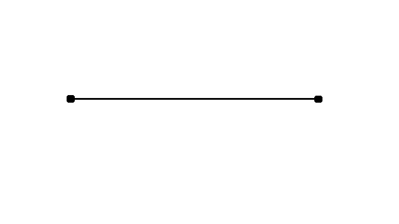
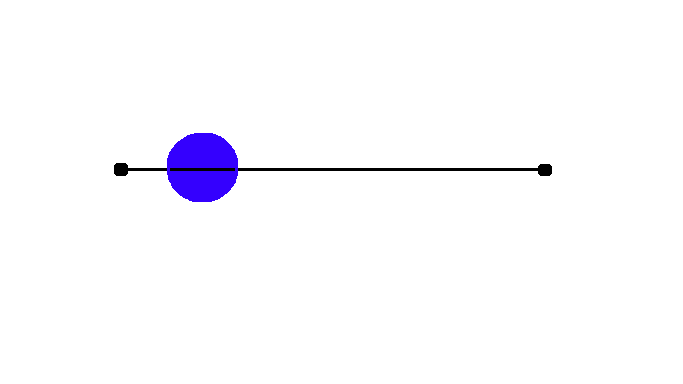
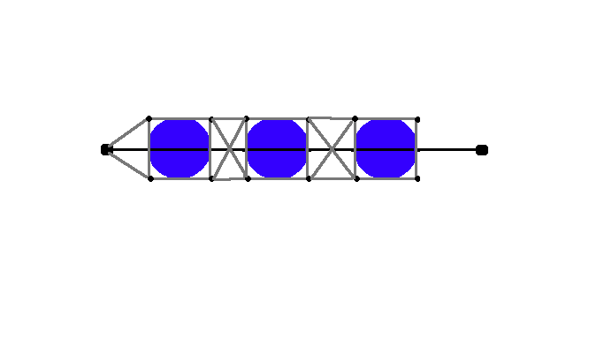
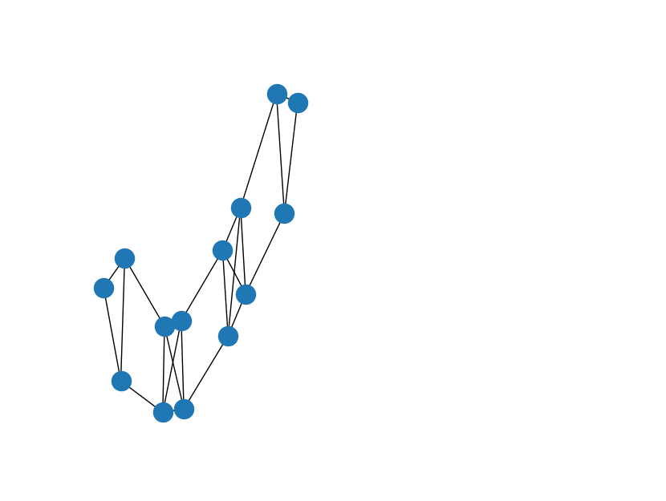
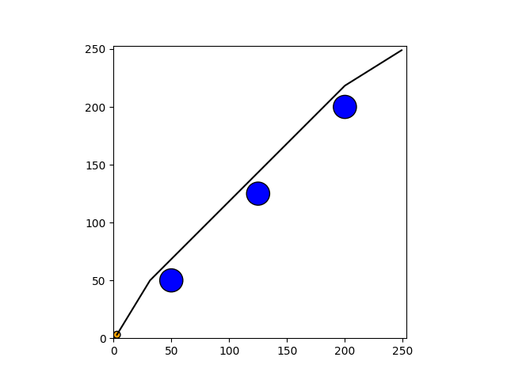

# Pathfinder

## Introduction
Pathfinder is a library written in Python designed to allow a robot to navigate a map of obstacles. The library supports the following features:
* Create a map of a given size for a robot with a specified radius
* Add circular obstacles to the map individually or as a list
* Generate a path between a given start and end location on a map that avoids obstacles
* Save/load a map to/from a file
* Visualize the current map and any path that has been generated

Python was chosen primarily because of its extensive library support, ease of use, and portability. Please refer to the subsequent sections for reasoning behind design and implementation specifics.

The pathfinding algorithm is based on the following:

Masoudi, Nafiseh, "Geometric Path-Planning Algorithm in Cluttered 2D Environments Using Convex Hulls" (2017). All Theses. 2784.
https://tigerprints.clemson.edu/all_theses/2784

## Using Pathfinder
### Setup
A virtual environment is recommended to avoid introducing dependency issues to your system:

`python3 -m venv venv`

Activate the virtual environment once it is created:

`source venv/bin/activate`

Install the required package dependencies:

`pip install -r requirements.txt`

### Pathfinding
To begin, create a Map object of specified dimensions containing a robot with a given radius:

`from pathfinder import pathfinder as pf`

`f = pf.Map(250,250,3)`

Input parameters are forced positive for simplicity, meaning that (0,0) is located at the bottom-left corner of the map.

Obstacles can be added to the map by creating an Obstacle object and passing it to the addObstacle method. The parameters of addObstacle are a Point object and a radius:

`o = pf.Obstacle(Point(125,125), 5))`

`f.addObstacle(o)`

Adding a List of Obstacles is also supported using the addObstacleList method.

_Note: Attempting to add an obstacle at a location that would cause it to intersect with an existing obstacle will cause the addition to fail._

Calculate a path from a start Point to an end Point using the generatePath method:

`f.generatePath(pf.Point(3,3), pf.Point(249,249))`

The generatePath method will route a path around existing obstacles to reach the specified location. The method will return a List of Points describing the best path across the map. The path data will also be saved in the Map object in terms of its components (x and y data) for visualization with matplotlib.

_Note: Attempting to generate a path with a start or end point that would intersect with an existing obstacle will fail and a new Point will have to be chosen._

Create a visual representation of the map with the visualizeMap method:

`f.visualizeMap()`

This will use matplotlib to plot the current map including the robot position, any obstacles added to the map, and any path that has been generated.

_Note: Adding an obstacle will delete any stored path data to prevent visualization of a path over an invalid map._

The Map object can be written to a file with the saveMap method. This uses the Pickle module to write the given map to a file with the specified name in the current directory:

`pf.saveMap(f, 'foo.map')`

A saved map can be loaded by giving the loadMap method a filename:

`x = pf.loadMap('foo.map')`

## Geometric Representation
After considering various ways to represent the map, a system based on Cartesian coordinates was chosen for increased coordinate resolution. This model also allows for simplification by adjusting the obstacles' radii to account for the robot's radius which allows the robot to be treated as a point. Path calculation can then be accomplished using simple planar geometry.

### Data Structures
Fundamental data structures were defined which describe Points, Paths, and Obstacles on the map.
#### Point
A Point is composed of the following:
* x: Position on the X axis
* y: Position on the Y axis

#### Path
A Path is composed of the following:
* start_point: A Point object describing the start point of the path
* end_point: A Point object describing the end point of the path
* length: The length of the path

#### Obstacle
An Obstacle is composed of the following:
* position: A Point object describing the location of the center of the obstacle
* radius: A value describing the radius of the obstacle
* distance_from_start: Distance from the start point of a path to be routed (used in rerouting algorithm)
* endpoint_top: A Point on the far positive side of the Obstacle (with reference to a given path's start point), used in rerouting algorithm as a start point for routing around subsequent obstacles
* endpoint_bot: A Point on the far negative side of the Obstacle (with reference to a given path's start point), used in rerouting algorithm as a start point for routing around subsequent obstacles

## Intersection Detection
Since the shortest distance between two points is a straight line, a straight line is first considered when generating a path. If the line does not intersect with any obstacles on the map, then there is no need for rerouting and the straight line can be considered the best path. 

_Figure: Ideal Path_

Recall that since the robot has a size, an intersection will occur if the path passes within one robot_radius of an obstacle.

In the event that the initial path intersects with one or more obstacles, then the intersecting obstacles are stored and the rerouting algorithm is applied.

_Figure: Path Intersects Obstacle_

## Rerouting
When the initial path intersects with one or more obstacles, the rerouting algorithm is applied:

* The intersecting paths (stored in a List) are sorted by their distance to the start point of the original path
* A circumscribing square is drawn around the first obstacle in the list, and paths are defined between the corner Points of the square. Paths are also defined from the start point to each of the corners on the side of the square nearest to the start point, resulting in a pentagonal shape

_Figure: Initial Bounding Box_
* Circumscribing squares are drawn for each subequent obstacle. For each obstacle, the two points on the side farthest from the start point are treated as new start points for the following obstacle's pentagonal bounding box. Note that since there are two of these points this process is performed twice.

* The last obstacle in the list is bounded by a box that treats the end point as its start point to complete the connection to the end point

_Figure: Circumscribing the Final Obstacle_

* The path segments generated by circumscribing squares and connecting points are stored in a list which is then checked for intersections with existing obstacles. The rerouting algorithm is applied recursively for new paths that intersect obstacles

## Generating the Best Path
Paths generated by the rerouting algorithm are used to generate a Graph in which Nodes are represented by path start and end points and edge weights are determined by path length. 

_Figure: Free Space Graph (Generated by NetworkX)

Djikstra's algorithm is then applied to find the shortest path between the start and end points. Because the input paths were generated by circumscribing obstacles (accounting for the robot's radius), the resulting path should be the shortest connecting path that avoids all obstacles.

_Figure: Rerouted Path_

## Additional Considerations
### Performance
The bottleneck in this library is generating the path segments to feed into the Free Space Graph. This is because every generated path needs to be checked against every existing obstacle and intersecting paths are recursively rerouted.

Performance could be improved by implementing some kind of memoization to cache paths resulting from circumscribing the obstacles -- a brief inspection of the algorithm would reveal that there are repeated calculations for each of the obstacles since the circumscribing function is called twice for each obstacle other than the first and last. These repeated calculations could be stored (perhaps as members of the Obstacle class) to save computation time.

Due to the recursive nature of the algorithm and the possible complexity of calculations depending on the number of obstacles and their positions on the map, it is possible (but unlikely) to encounter a RecursionError where the maximum recursion depth is exceeded. This could be solved by converting the implementation to a non-recursive solution which will likely be more complex but will be more reliable.

Another way to improve performance could be to treat obstacles that are close together (perhaps too close for the robot to fit through) as a single entity to be routed around.

### Modularity
The generatePath method could be augmented with an optional argument that specifies the algorithm to use for rerouting. The method would then branch depending on the parameter value. Additional algorithms that could be added include using a Voronoi diagram (this will maximize clearance between the robot and obstacles which could be desirable depending on the application) or a visibility graph as an input to the Free Space Graph 

### Cross-Platform
Part of the reason Python was chosen for this project is because of its cross platform library support. One thing to watch out for when using this library is using absolute paths for filenames when saving/loading a Map, as system structures will differ between platforms.
